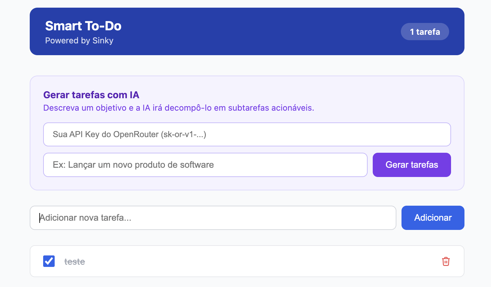
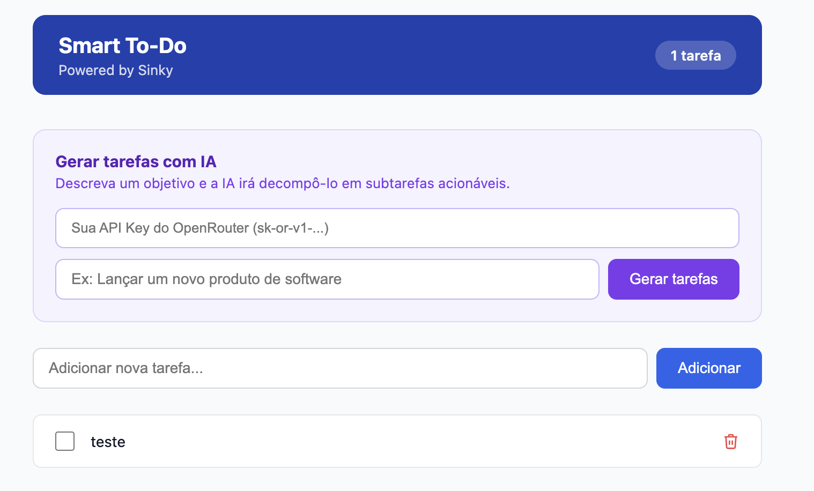
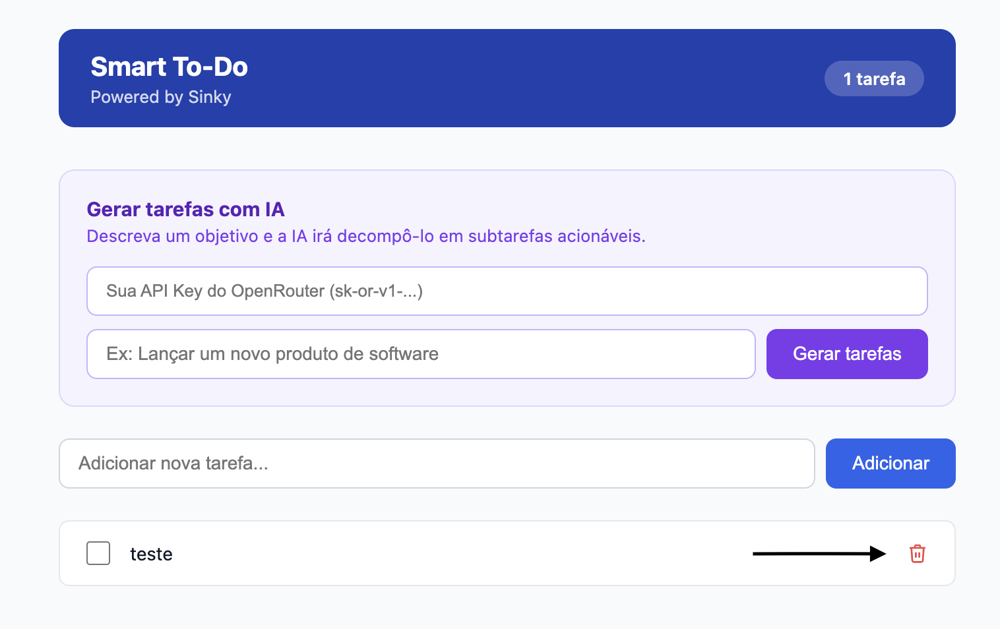
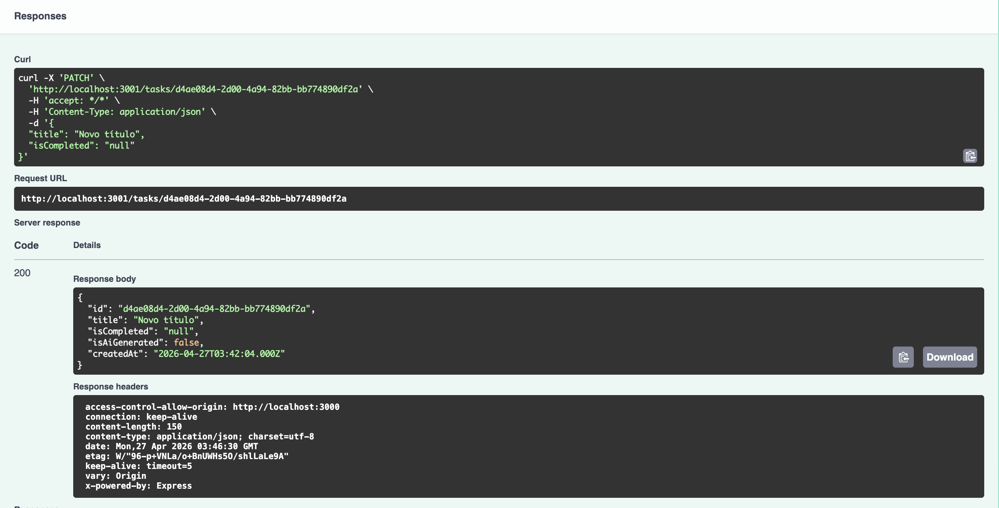
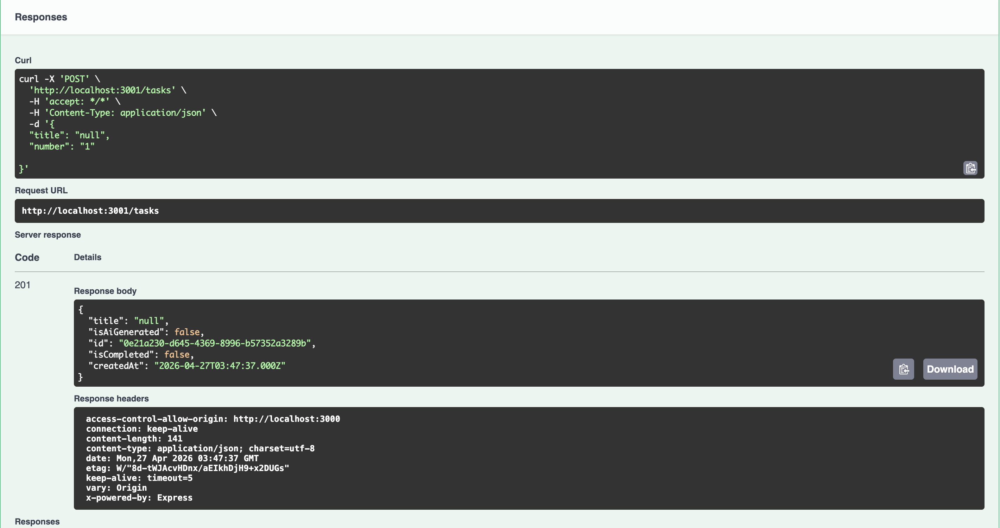
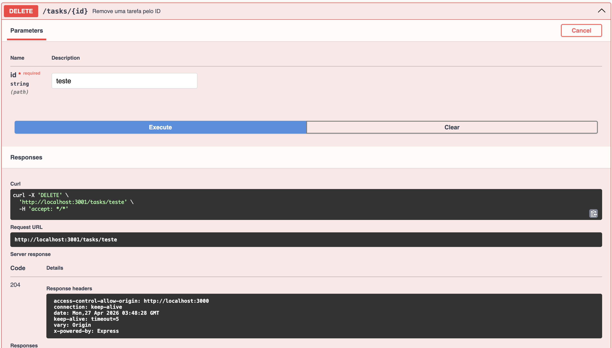
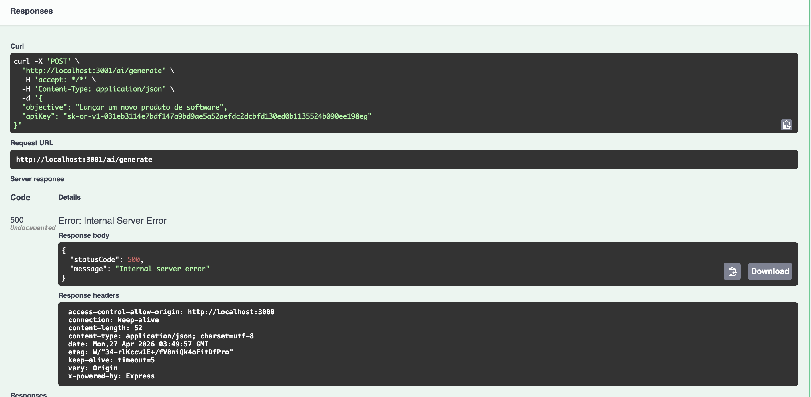

## [BUG-001] Falta de validação e feedback ao não informar API Key na geração de tarefas com IA

**Severidade:** Alta  
**Prioridade:** P1  
**Componente:** Backend | UX | API  

### Descrição

Ao tentar gerar uma tarefa utilizando IA sem fornecer a API Key, o backend retorna erro 400, porém o usuário não recebe nenhuma mensagem clara na interface informando que o campo é obrigatório. Além disso, o campo não está marcado como obrigatório no frontend, o que prejudica a experiência e entendimento do fluxo.

### Passos para Reproduzir

1. Acessar funcionalidade de geração de tarefas com IA  
2. Não informar a API Key
3. Preencher o objetivo  
4. Tentar gerar a tarefa  

### Resultado Esperado

O sistema deve exibir uma mensagem clara informando que o campo API Key é obrigatório antes da requisição ou ao retornar erro.

### Resultado Obtido

Backend retorna:
```json
{
  "message": [
    "apiKey should not be empty"
  ],
  "error": "Bad Request",
  "statusCode": 400
}

```

## [BUG-002] API Key inválida retorna erro 500 ao invés de erro 401

**Severidade:** Crítica  
**Prioridade:** P1  
**Componente:** Backend | API | UX  

### Descrição

Ao inserir uma API Key inválida ou incompleta, o sistema deveria retornar erro 401 (não autorizado), porém está retornando erro 500 (internal server error), além de não exibir nenhuma mensagem ao usuário.

### Passos para Reproduzir

1. Inserir API Key inválida
2. Preencher o campo objetivo  
3. Tentar gerar tarefa com IA  

### Resultado Esperado

Retornar erro 401 com mensagem clara de API Key inválida ou sem permissão.

### Resultado Obtido

```json
{
  "statusCode": 500,
  "message": "Internal server error"
}

```

## [BUG-003] Estado de tarefa não persiste após refresh da página

**Severidade:** Crítica  
**Prioridade:** P1  
**Componente:** Frontend | Backend | UX  

### Descrição

Ao marcar uma tarefa como concluída (criada via IA ou manual) e atualizar a página, o estado volta para "não concluído", indicando que o estado não está sendo persistido corretamente.

### Passos para Reproduzir

1. Criar uma tarefa via IA ou manual 
2. Marcar como concluída  
3. Dar refresh na página  

### Resultado Esperado

A tarefa deve permanecer marcada como concluída após atualização.

### Resultado Obtido

A tarefa volta para estado não concluído.

### Evidência




### Sugestão de Correção

Garantir persistência do estado no backend e correta renderização no frontend.


## [BUG-004] Exclusão de tarefa sem confirmação do usuário

**Severidade:** Média  
**Prioridade:** P2  
**Componente:** UX | Frontend  

### Descrição

O sistema permite excluir tarefas diretamente sem exibir modal de confirmação, aumentando o risco de exclusões acidentais.

### Passos para Reproduzir

1. Criar uma tarefa  
2. Clicar em excluir  

### Resultado Esperado

Exibir modal de confirmação antes da exclusão.

### Resultado Obtido

Tarefa é excluída imediatamente.

### Evidência



### Sugestão de Correção

Implementar modal de confirmação antes da ação de delete.


## [BUG-005] Erro 404 em PATCH /task/{id} não documentado no Swagger

**Severidade:** Média  
**Prioridade:** P2  
**Componente:** API | Backend | Documentação  

### Descrição

Ao enviar um ID inválido para PATCH /task/{id}, a API retorna erro 404, porém esse comportamento não está documentado no Swagger.

### Passos para Reproduzir

1. Fazer PATCH em /task/{id} com ID inexistente  
2. Observar resposta  

### Resultado Esperado

Swagger deve documentar erro 404 como resposta possível.

### Resultado Obtido

```json
{
  "error": "Task not found"
}

```

## [BUG-006] Campo isCompleted aceita valores inválidos

**Severidade:** Alta  
**Prioridade:** P1  
**Componente:** Backend | API  

### Descrição

O campo `isCompleted` aceita valores diferentes de boolean (true/false), como `null`, sem validação adequada, retornando 200.

### Passos para Reproduzir

1. Fazer PATCH em /task/{id}  
2. Enviar `isCompleted: null`  

### Resultado Esperado

Retornar erro 400 para valores inválidos.

### Resultado Obtido

API retorna 200 com valor inconsistente.

### Evidência



### Sugestão de Correção

Validar tipo estrito boolean no backend.


## [BUG-007] POST /tasks aceita campos extras sem validação

**Severidade:** Alta  
**Prioridade:** P1  
**Componente:** Backend | API | Segurança  

### Descrição

O endpoint POST /tasks permite envio de campos não previstos (ex: "Number"), sem validação e retorna 201.

### Passos para Reproduzir

1. Enviar POST /tasks com body contendo campos extras  
2. Observar resposta  

### Resultado Esperado

Retornar erro 400 para payload inválido.

### Resultado Obtido

201 Created com dados extras aceitos.

### Evidência



### Sugestão de Correção

Implementar validação estrita do DTO/schema.


## [BUG-008] DELETE /tasks/{id} não valida existência do ID

**Severidade:** Alta  
**Prioridade:** P1  
**Componente:** Backend | API  

### Descrição

O endpoint DELETE aceita qualquer ID e retorna 204 mesmo quando o recurso não existe, sem validação.

### Passos para Reproduzir

1. Enviar DELETE com ID inexistente  
2. Observar resposta  

### Resultado Esperado

Retornar erro informando que o ID não existe.

### Resultado Obtido

204 No Content mesmo sem validação.

### Evidência



### Sugestão de Correção

Validar existência antes de deletar e retornar 404 quando necessário.


## [BUG-009] POST /ai/generate retorna erro 500 ao invés de 401 com API Key inválida

**Severidade:** Crítica  
**Prioridade:** P1  
**Componente:** Backend | API | IA  

### Descrição

Ao enviar API Key inválida para geração via IA, o sistema retorna erro 500 ao invés de 401, indicando falha de tratamento de autenticação.

### Passos para Reproduzir

1. Inserir API Key inválida  
2. Chamar POST /ai/generate  

### Resultado Esperado

Retornar erro 401 com mensagem de autenticação inválida.

### Resultado Obtido

Erro 500 Internal Server Error.

### Evidência



### Sugestão de Correção

Tratar erro de autenticação corretamente e mapear para 401.
